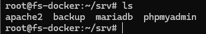
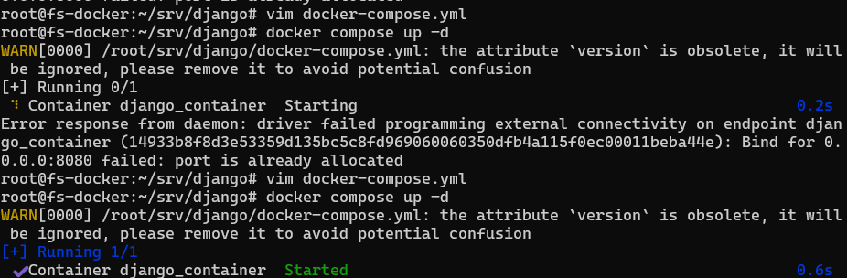
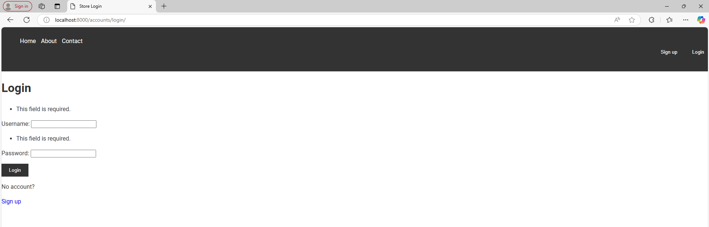
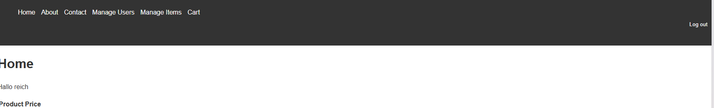
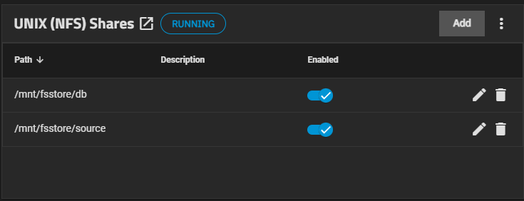
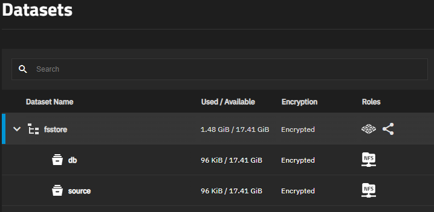

# Backup- und Restore-Systeme implementieren

## Auftraggeber

- Rohr Philipp

## Projektende/-abgabe

- (geplant) 24.01.2025

## Beschreibung

Ein Backup-Konzept eines Betriebs entwickeln und dieses umsetzen.

## Hindernisse

- Benutzerdaten sind immer die wichtigsten Daten, ansonsten soll man zwischen Nutz- und Nichtnutzdaten entscheiden.
- Man sollte Daten auf der Cloud und lokal ein Backup zu haben, damit man im Falle eines Datenverlustes, Bankrupts bei
  der Cloud die Daten immer noch wiederherstellen kann.
- Die Migration der Django-Datenbank von PostgreSQL zu MariaDB könnte einige Herausforderungen mit sich bringen.  
  PostgreSQL und MariaDB haben unterschiedliche Syntaxen für Indizes, Datentypen und Constraints, was zu
  Inkompatibilitäten führen kann. Beispielsweise müssen `JSONField`-Felder in Django für MariaDB angepasst werden,
  da diese in PostgreSQL anders strukturiert sind.

# User Story

Als Verantwortlicher der Daten des Betriebs "Fashion Store" möchte ich ein Backup-Konzept erstellen, um im Falle eines
Datenverlustes die Daten wiederherstellen zu können.

# Datensicherheitskonzept

Folgendes plane ich zu sichern:

- Kundendaten in verschlüsselter Form im TrueNAS
-

# Infrastruktur

## Netzwerk

Vorab als Information: bei jedem Container ist die IP-Adresse statisch bestummen, da die Container miteinander verknüpft
sind. Bei dynamischer IP-Adresse kann die ganze umgebung auseinanderfallen, da der Webserver beispielsweise nicht mit
der Datenbank kommunizieren kann.

## Dockerserver

| Einstellung   | Wert |
|---------------|------|
| Memory        | 4GB  |
| Prozessoren   | 2    |
| Speicherplatz | 20GB |

### Details

Um die Infrastruktur simpel zu behalten, arbeite ich mit zwei Dockerservern / Ein Server, der Docker und Portainer  
installiert hat und worauf Container für die Datenbank und für die Webseite erstellt werden. Der Andere Dockerserver
dient zu Backupzwecken.
Der Vorteil dieses Vorgehens ist, dass ich dann nur bei einem Server ein Backup durchführen muss und dass ich nach Lust
und Laune auch zusätzliche Container erstellen kann, falls ich beispielsweise einen Mailserver brauche.
Auf dem Backup Dockerserver erstelle ich eine Datenbank für das Backup der Produktiv-Datenbank und alle Django Apps.



## Datenbankserver (container)

| Einstellung    | Wert       |
|----------------|------------|
| IP             | 172.29.1.2 |
| Datenbank      | Mariadb    |
| Container Name | mariadb    |

### docker-compose

```yaml
version: "3.9"

services:
  mariadb:
    image: mariadb:latest
    container_name: mariadb
    restart: always
    environment:
      MYSQL_ROOT_PASSWORD: /run/secrets/db_root_password  # Set the root password
      MYSQL_DATABASE: clothingstore_db          # Initial database to create
      MYSQL_USER: db_user            # Username for the database
      MYSQL_PASSWORD: db_password    # Password for the user
    ports:
      - "3306:3306"  # Expose the MariaDB port to the host
    volumes:
      - mariadb_data:/var/lib/mysql       # Persist database data
    networks:
      mariadb_net:
        ipv4_address: 172.29.1.2
    secrets:
      - db_root_password
      - db_password
      - db_user

volumes:
  mariadb_data:

networks:
  mariadb_net:
    driver: bridge
    ipam:
      config:
        - subnet: 172.29.1.0/24

secrets:
  db_root_password:
    environment: DB_ROOT_PASSWORD
  db_password:
    environment: DB_PASSWORD
  db_user:
    environment: DB_USER
```

### Details

Für den Datenbankserver benutze ich MariaDB. Den Datenbankserver habe ich in einem Docker Container erstellt. Diese hat
eine statische IP-Adresse, damit der Web-Server mit der Datenbank kommunizieren kann, auch wenn der Container neu
gestartet wird.

Die Anmeldeinformationen zur Datenbank sind als Umgebungsvariablen gespeichert, damit diese nicht direkt in das
docker-compose hereingeschrieben werden müssen.

Da Django SQLite benutzt, muss ich dessen Daten mit `py manage.py dumpdata` exportieren, und diese dann in mariadb
einfügen und migrieren. Das Format der exportierten Daten ist standartweise in einem JSON-Format. Jedoch müssen sie
entweder in der Sprache von SQL sein oder CSV-Formatiert, damit sie in MariaDB importiert werden können.

Zum Testen habe ich einen phpmyadmin container erstellt, um Daten von Django einfach zu importieren.

### Migration

Für die Migration habe ich Python benutzt um die JSON Daten zu einer MariaDB Importierbaren SQL Struktur umzuwandeln.

Der JSON-Dump ist einfach strukturiert und beinhaltet in jedem JSON-Objekt den Model-Namen, den Primary Key und die
entsprechenden Felder welches es einfach für mich macht, die JSON-Daten zu strukturieren.

Unten aufgeführt ist das Script:

```python
import json
from os import write

def json_to_sql(json_data):
    sql_queries = []

    for entry in json_data:
        model = entry['model']
        pk = entry['pk']
        fields = entry['fields']

        # Prepare the field names and values
        field_names = []
        field_values = []

        for field, value in fields.items():
            field_names.append(field)
            # If the value is a string, add quotes around it
            if isinstance(value, str):
                field_values.append(f"'{value}'")
            else:
                # If the value is not a string, keep it as is
                field_values.append(str(value))

        # Create the SQL statement for INSERT
        field_names_str = ', '.join(field_names)
        field_values_str = ', '.join(field_values)

        sql_query = f"INSERT INTO {model} ({field_names_str}) VALUES ({field_values_str});"
        sql_queries.append(sql_query)

    return sql_queries


# Example JSON data (use your JSON string here)
with open('db.json') as f:
    json_data = json.load(f)

# Convert JSON to SQL
sql_statements = json_to_sql(json_data)

# Print SQL statements
for sql in sql_statements:
    print(sql)
    # Write SQL statements to a file
    with open('db.sql', 'a') as f:
        f.write(sql + '\n')
```

Und ein kleiner Abschnitt des Resultats:

```sql
INSERT INTO fashionSite.itemmodel (category, name, description, price, stock)
VALUES (1, 'Basic T-Shirt', 'Description', 14.99, 0);
INSERT INTO fashionSite.itemmodel (category, name, description, price, stock)
VALUES (1, 'Gloves', 'Gloves', 4.99, 45);
```

Diese Modelle sind benutzerdefiniert erstellt und beschreiben die Produkte des Kleiderladens

## Webserver (container)

| Einstellung    | Wert       |
|----------------|------------|
| IP             | 172.28.1.2 |
| Paket          | Apache2    |
| Container Name | apache     |

### docker-compose

```yaml
version: '3.8'

services:
  apache:
    image: httpd:latest  # Using the latest official Apache image
    container_name: apache  # Container will be named "apache"
    ports:
      - "80:80"  # Exposing port 80 from the container to the host machine
    volumes:
      - ./html:/usr/local/apache2/htdocs  # Optional: Mount a directory from host to container (your custom HTML files)
    networks:
      apache_net:
        ipv4_address: 172.28.1.2
    restart: always  # Always restart the container unless stopped manually

networks:
  apache_net:
    driver: bridge
    ipam:
      config:
        - subnet: 172.28.1.0/24
```

### Details

Mithilfe von apache2 konnte ich einen einfachen Webserver erstellen. Das docker-compose file habe ich so geschrieben,
dass der 80er Port / der HTTP Port geöffnet ist. Somit kann man für Test Zwecke über die IP-Adresse auf den Server
zugreifen, solange man sich im Netzwerk befindet.



Den Port habe ich auf 8888 zugewiesen. Heisst er ist bei diesem Port über HTTP erreichbar.

### Webseite

Für die Webseite habe ich mich entschieden Django zu benutzen. Der Grund dafür ist, dass Django sehr umfangreich ist,
und ich es vorhin noch nie benutzt habe. Beispielsweise ist die integrierte Datenbankfunktion sehr hilfreich, da ich
dann keinen Datenbankserver erstellen muss.

Ich habe damit angefangen, das Django Projekt zu erstellen mithilfe von Pycharm. Dies hat es mir ermöglicht, die
Webseite lokal bei mir zu entwickeln mit einem virtuellen Python environment. Für das Projekt habe ich auch ein
Repository erstellt, damit ich dieses, sobald ich die Entwicklungsphase beendet habe, diese auf den Webserver klonen
kann und in die Produktion einsteigen kann.

In die Django-Seite wollte ich eine API integrieren, damit man die zugänglichen Daten abrufen kann wie beispielsweise
die Produkte des Kleiderladens. Mit dem Rest-Framework für Django habe ich dies einfach umsetzen können.

Die Datenbank wollte ich nicht auf dem Web-Server betreiben, sondern es sollte auf einem separaten DB-Server ablaufen.

In der Webseite selbst sollte man Accounts haben, also sich einloggen, ausloggen und registrieren können. Diese
Funktion war bereits in Django programmiert worden, also musste ich diese nur mit der Templatesprache in die
HTML-Seiten einfügen. Zu einer gewöhnlichen Seite, die Kleider verkauft, gehören auch viele DB-Modelle / Objekte.

Die Datenbank wollte ich nicht auf dem Web-Server betreiben, sondern es sollte auf einem separaten DB-Server ablaufen.
Da die Datenbank von Django Standardweise auf SQLite lauft und ich die Datenbank auf dem Datenbankserver mit
MariaDB betreiben möchte, muss ich eine Migration durchführen, die Daten dumpen und diese dann anpassen, sodass sie in
MariaDB eingefügt werden können.

## Datenbank




Administrative Übersicht

# Backup

# Backup

Für den Backupserver habe ich einen separaten Dockerserver auf einem Debian Betriebssystem aufgesetzt. Diesen benutze
ich dann, um die Images, die Django-Applikationen mitsamt Source-Code und die Daten der Datenbank zu speichern.

## Dockerserver

## TrueNAS Backup

Um einen weiteren Speicherort zu haben, auf welchem Daten gesichert sind, habe ich mich für einen TrueNAS Backup
entschieden. Auf diesem sollte dann alle wichtigen Kundendaten, Produkte und der Sourcecode der Webseite und der
Datenbank gespeichert werden.



Ich habe ein Dataset erstellt, welches alle wichtige Daten und Dateien beinhalten sollte. In diesem habe ich dann zwei
Ordner erstellt:

- db
    - Für die datenbank. Hierin werden die dumps als tar-Datei gespeichert.
- source
    - Hier werden alle Daten der Django Applikation gespeichert. Zudem werden hier auch die HTML-Dateien gespeichert und
      auch die Kundendaten.

Für das Dataset habe ich einen NFS Share erstellt. Dieser dient als Verknüpfung zwischen dem FS-Docker und dem TrueNAS.



Die Daten habe ich entsprechend verschlüsselt mit einem Verschlüsselungsalgorithmus. Die Verschlüsselung habe ich mit
AES-256 durchgeführt. Die Verschlüsselung konnte ich aber erst durchführen, nachdem ich mich schon mit meinem Linux
Client per NFS auf TrueNAS verbunden habe.

Beim TrueNAS-Backup musste ich sicherstellen, dass der NFS-Share korrekt mit den richtigen Berechtigungen eingerichtet
wurde. Es war wichtig, bei `maproot-user` den root user zu spezifizieren, damit man von einem anderen Server aus, in
meinem Fall beim `FS-Docker` Server auf das NFS zugreifen kann und die benötigten Berechtigungen hat, Dateien zu
erstellen.

Mit dem Befehl `sudo mount -o rw,vers=3 <IP des TRUENAS>:/mnt/<pfad> <Lokaler Pfad>` konnte ich einen NFS Share
erstellen. Für den source und den db-share habe ich jeweils eine Verknüpfung per NFS erstellt und somit auch zwei
directories auf dem Linux Server

Ich hatte auch die Möglichkeit, einen SMB-Share zu erstellen, jedoch benötigte ich dafür eine Domäne, welche ich nicht
hatte.

## Gitlab Container Registry Backup

Bei einer Umgebung, in der Hauptsächlich Docker benutzt wird, arbeitet man auch mit vielen Images. Damit diese auch
einen Ablageort bekommen, werde ich diese in einen Gitlab Container Registry speichern. Die Gitlab Container Registry
Funktion ist vollkommen integriert mit Gitlab. Bei einem Backup kann man also mithilfe des Gitlab CI das Image von einer
Remote Quelle vollkommen und problemlos wiederhergestellt werden.

Da die Docker-Container für den Betrieb der Webseite und der Datenbank essenziell sind, habe ich eine Backup-Strategie
für die Container-Images in GitLab Container Registry implementiert. Dies stellt sicher, dass alle notwendigen Images
jederzeit verfügbar sind, selbst wenn der ursprüngliche Build-Server ausfällt oder versehentlich Daten gelöscht werden.

Mit dem Befehl `docker login registry.gitlab.com` konnte ich mich einloggen und die Container, die ich spezifizierte,
sichern.

## Automatisierung

Die Backup-Strategie ist so konzipiert, dass automatisch tägliche Snapshots der Datenbank erstellt werden.  
Dazu verwende ich `mariadb-dump`, um alle Tabellen der MariaDB-Datenbank in regelmäßigen Intervallen zu sichern.

Die Daten werden wie folgt gespeichert:

- **Lokale Sicherung**: Die Dumps werden auf dem Backup-Dockerserver gespeichert.
- **Externe Sicherung**: Die Backup-Dateien werden regelmäßig auf das TrueNAS-System übertragen.

Zusätlich zum Dump habe ich ein Cronjob erstellt. Dies erstellt einen wöchentlichen Voll-Backup

```bash
#!/bin/bash

SOURCE_DB_DIR="/root/srv/backup/db"
DEST_DB_DIR="/mnt/nfs/db"
SOURCE_SOURCE_DIR="/root/srv/backup/source"
DEST_SOURCE_DIR="/mnt/nfs/source"

DATE=$(date +"%Y-%m-%d_%H-%M-%S")

CONTAINER_NAME="mariadb_container"  
DATABASE_NAME="fashionstore"       
DB_USER="admin"                      
DB_PASSWORD="admin"         

DB_DUMP_FILE="${DEST_DB_DIR}/db_backup_${DATE}.sql"

docker exec $CONTAINER_NAME mysqldump -u$DB_USER -p$DB_PASSWORD $DATABASE_NAME > $DB_DUMP_FILE

# db
tar -czf "${DEST_DB_DIR}/db_backup_${DATE}.tar.gz" -C "$DEST_DB_DIR" "$(basename $DB_DUMP_FILE)"

# source
tar -czf "${DEST_SOURCE_DIR}/source_backup_${DATE}.tar.gz" -C "$SOURCE_SOURCE_DIR" .

echo "DB backup fertig: $DATE" >> "${DEST_DB_DIR}/backup_log.txt"
echo "Source backup fertig: $DATE" >> "${DEST_SOURCE_DIR}/backup_log.txt"
```

# Auswertung

Meiner Meinung nach habe ich dieses Projekt gut abgeschlossen und bin sehr zufrieden mit meinem Endresultat. Das gesamte
Projekt zu bearbeiten hat mir sehr gefallen und ich werde definitiv einige angewandte Techniken und Tools in der Zukunft
wieder verwenden.

## Backup

Ich bin stolz auf mein Backup-Konzept und wie ich es in der Praxis angewandt habe. Die Automatisierung des Backups,
sprich die Skripts, die ich für die Backups geschrieben habe, waren meist ohne Probleme gut auszuführen und umzusetzen.
Da ich mich Python und in PowerShell gut auskenne, da ich freiwillig diese Sprachen im Betrieb gelernt und angewandt
habe. Das Wissen dieser Sprache konnte ich umwandeln und bei Bash anwenden, um die Scripts für die automatisierungen zu
schreiben.

Mit dem Backup bei TrueNAS bin ich äusserst zufrieden und meine persönlichen Erwartungen sind getroffen betreffend den
Funktionalitäten des Produktes. Eventuell werde ich dies Produkt entweder Privat oder geschäftlich mal wieder benutzen.

Womit ich Mühe hatte, war der geplante Backup-Docker-Server. Für diesen konnte ich die Container bereitstellen. Aber
bei der Verknüpfung zwischen dem FS-Docker Server und dem FB-Docker Server (Backup und Produktiv).

## Funktionalität

Persönlich finde ich, dass die Umgebung und die einzelnen Maschinen sauber funktionieren. Mit der Webseite bin ich sehr
zufrieden, da ich sehr vieles gelernt habe und ein bisschen ausprobieren konnte mit Django.

Die Datenbank, die ich migriert habe, funktioniert einwandfrei mit der Webseite und ich bin glücklich, dass mein Python
Script welches JSON zu SQL konvertiert funktioniert hatte.

Das Voll-Backup von der Datenbank und dem App-Container funktioniert, sowie das Backup mit dem Gitlab
Container-Registry.

# Reflexion

Rückblickend bin ich sehr zufrieden mit diesem Projekt. Im Laufe des Vorgangs gab es einige Rückschläge, die mich dazu
führten den Plan umzudenken, ein paar Schritte zurückzukehren und diese zu wiederholen oder sogar Ideen vollständig zu
streichen, weil diese entweder nicht im Zeitraum des Projekts passten oder diese Ideen zu kompliziert waren umzusetzen.
Im Folge eines Rückschlags versuchte ich immer motiviert zu sein und am Ball zu bleiben, damit ich mein Projekt
möglichst effizient und zeitgerecht fortsetzen konnte. Da ich jedoch Frameworks und Systeme gewählt haben, die gut
miteinander fungieren, konnte ich mich recht gut durch das Projekt navigieren.

Letztendlich war mein Ziel jedoch, nicht nur die mir bereits bekannten Methoden und Software anzuwenden, sondern auch
neues zu lernen. Beispielsweise habe ich konstant und ohne Pause an der Webseite mit Django im Betrieb gearbeitet (damit
ich meinen Fokus in der Schule hauptsächlich dem Backup richten kann). Bei der Kreierung einer Webseite mithilfe Django
habe ich massiv viel gelernt über die Model struktur, URL Routing, Views, Forms und vieles mehr, da Django ein
umfangreiches Framework ist.

Was ich für das nächste Mal mitnehme ist, dass ich mir nicht so ein grosses Projekt planen sollte und den Backup selbst
auch besser dokumentieren sollte. Ich habe teilweise zu viel Zeit mit Django vergeudet.

Persönlich bin ich sehr stolz auf meine errungenen Erkenntnisse währenddessen und hoffe in der Zukunft mehr über Backups
und Datensicherheiten im Detail zu lernen. 
